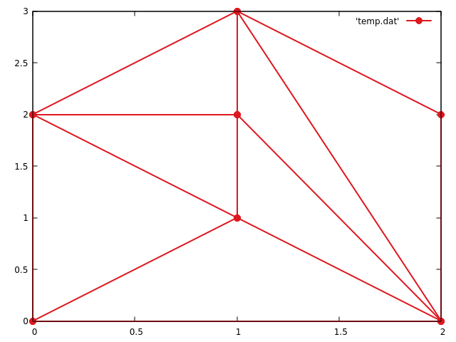

# Triangulator
 *A simple program for triangulation of a given set of points. This project is built for  GSoC2O19/Boost/Geometry(Project 3).*
## Prerequisites

```
gnuplot -v5.2 or greater
```

## Using the Repository 

*1.  Clone the repository.*
```
git clone https://github.com/NavneetSurana/PCT-Boot.Geometry
```

*2.  If gnuplot is not installed*
```
sudo apd-get install gnuplot
```

*3. Use g++ compiler for compilation.*
```
g++ -std=c++17 triangulation.cpp -o build
```
```
./build
```
## Test
This program has been tested with the following set of points.
**{(0,0), (0,2), (2,0), (1,1), (1,2), (1,3), (2,2)}**
It gave the following triangulation.


## Author

* **Navneet Surana** - *Some of my works can be viewed at* - [GitHub](https://github.com/NavneetSurana)
* *Along with this I have also worked on solving 9X9 Sudoku Puzzle using genetic algorithm.*
---
* *Thanks to GitHub for providing such an amazing open-source platform.*
* *I hope this project brings in new opportunities for me.*

 


